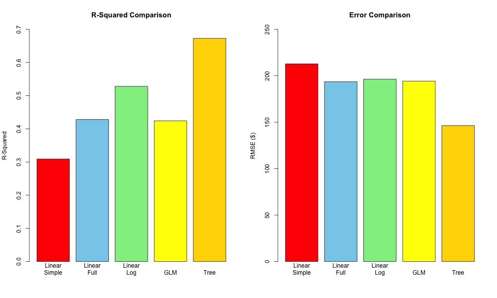

# Sneaker Resale Value Analysis

Predicting sneaker resale prices using machine learning, based on 99,956 real transactions from the StockX marketplace.

## Project Purpose

This project analyzes sneaker resale market data to understand pricing behavior, brand premiums, and demand patterns, supporting pricing, inventory, and investment decisions in the secondary sneaker market.

## Dataset Overview

- **Source:** StockX marketplace transaction data (2017-2019)
- **Size:** 99,956 real sneaker sales
- **Contents:** Sale price, retail price, brand, product attributes, order/release dates, buyer region
- Data was cleaned and feature-engineered prior to analysis (17 total variables after feature engineering)

## Tools Used

- R (data cleaning, modeling, and visualization)
- Microsoft Excel (data validation and summaries)

## Methodology

1. Data cleaning and preprocessing
2. Exploratory data analysis (EDA)
3. Feature engineering (markup %, days since release, premium brand flag, price tier, and more)
4. Predictive modeling, comparing 5 approaches:
   - Simple Linear Regression
   - Multiple Linear Regression
   - Log-Transformed Regression
   - Generalized Linear Model (GLM)
   - Decision Tree
5. Model evaluation using R² and RMSE
6. Extraction of business insights and recommendations

## Results

| Model | R² | RMSE |
|---|---|---|
| Linear (Simple) | 31% | $213 |
| Linear (Full) | 43% | $194 |
| Log Regression | 53% | $196 |
| GLM | 42% | $194 |
| **Decision Tree** | **58%** | **$165** |

The Decision Tree model performed best, capturing non-linear relationships (e.g., brand and age interacting) that the linear approaches missed.

## Key Insights

- Average resale price was $447 against an average retail price of $209, a 213% markup overall
- Brand reputation has a major effect on resale value: Yeezy, Off-White, and Jordan saw 200-400% markups, versus 50-100% for standard Nike/Adidas models
- Mid-range priced sneakers ($150-$220 retail) showed stronger resale performance (243% markup) than either budget or premium-priced items
- An early model was excluded after it showed signs of data leakage (a predictor derived from the target variable itself), a check that kept the final results honest

## Business Value

This analysis helps resale investors, marketplace analysts, and inventory planners make more informed pricing and sourcing decisions in the sneaker resale market.

## Repository Structure

- `analysis/` — R script with the full data cleaning, feature engineering, and modeling code
- `data/` — Raw and processed datasets
- `report/` — Executive summary report and presentation deck
- `visuals/` — Supporting charts and figures
